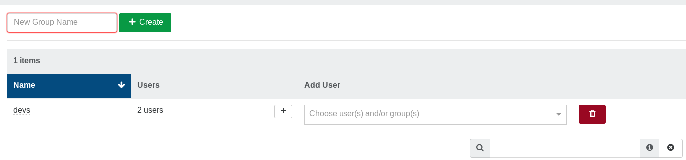

# Resource Delegation

This chapter covers how to delegate resources (VM, hosts, etc) to users.

The idea is to allow external users (not admins) to:

* interact only with their objects
* delegate VMs to your dev teams...
* ... or to your clients

> Remember: admins can do everything, thus permissions don't apply on them. It's only for *users*.

## Groups

Groups are a set of users. You can use groups to apply permissions/ACLs on a whole set of users, instead of repeating superfluous operations on multiple users separately.

Groups can be created and managed in the "Groups" view inside the "Settings" menu.

1. Create a group by giving it a name
2. Edit this group and add users in it

Any group can be edited as needed after its creation.

