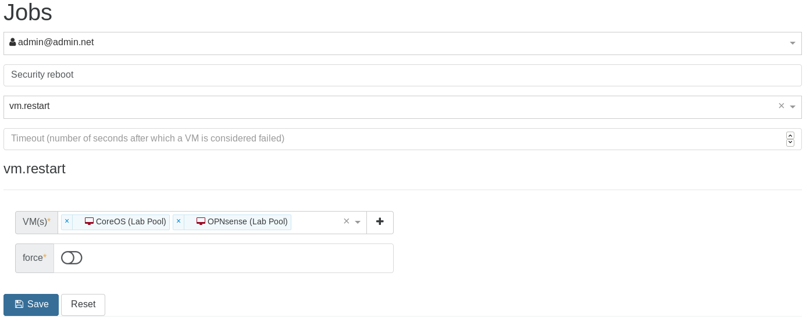
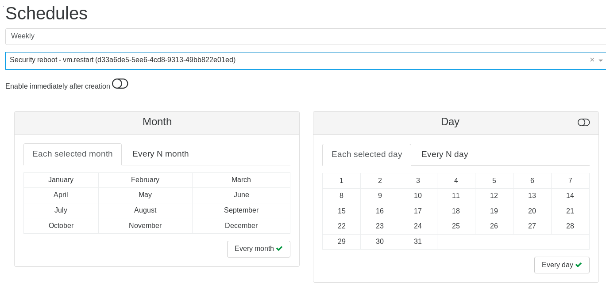
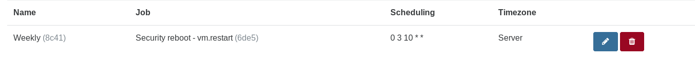

# Job manager

> Job manager is released since 4.10

The key idea is to be able to schedule any action (migrate, reboot etc.), like for backups, snapshots or DR.

In the main menu, go inside the "Job Manager" section:

You can now **schedule all actions** on your hosts, VMs, or ACLs. It's configured in 2 steps:

1. Create a job
1. Schedule it!

Real example, step by step: **Creating a job called "security reboot"** (in this case, restart "nfs" and "Core1" VMs):

Note that you can execute this job **now** by clicking on the orange play button (to test it for instance):

**Schedule the job** (every Sunday at 5:00 AM):

And this is it! The job is listed in the Overview:

Possibilities are infinite! You can plan a LOT of things (any actions on a VM, like migrate, start, clone, suspend etc. Same thing apply on a host).

## Examples

### Save on your electric bill

* plan a live migration on your VMs at 11:00PM on a less powerful host, to shutdown the big one
* start the big server at 6:00AM and migrate back VMs 15 minutes later

### Scale when needed

* schedule the boot of extra-VMs during your usual activity spikes (horizontal scaling)
* also plan more vCPUs or RAM to these VMs at the same time
* go back to the previous state when your planned load is low (e.g: during the night)

### Planned reboot

* your client app is not very stable, or you need to reboot every month after kernel updates: schedule this during the weekend!

### Add or Remove ACLs

* revoke your user ACLs Friday at 11:00PM (e.g: no access on the week end)
* restore them Monday at 6:00AM
