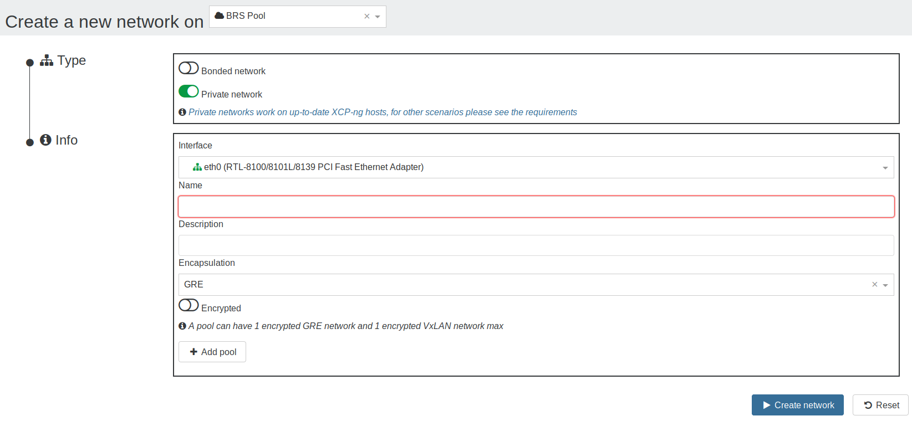
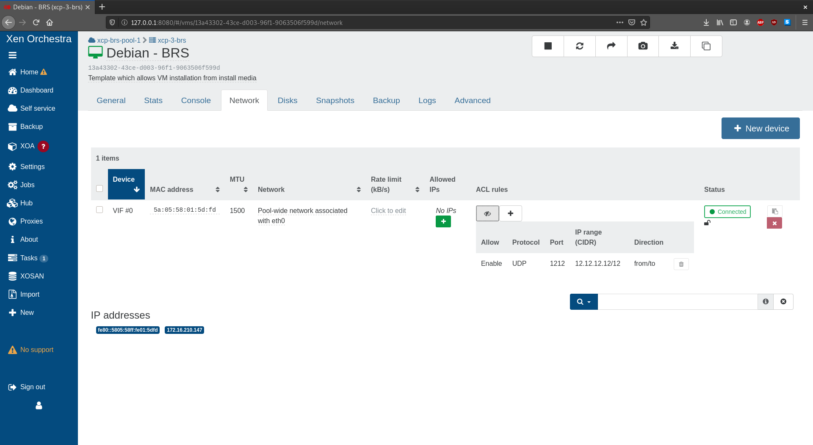

# SDN Controller

> SDN Controller is available in XOA 5.36.0 and higher

The SDN Controller enables a user to **create pool-wide and cross-pool** (since XOA 5.38.0) **private networks**.

## Screenshots

### Private network creation

### VIF network traffic rules

## How does it work?

Please read the devblogs related to the SDN Controller:

- [Creating pool-wide private networks](https://xen-orchestra.com/blog/xo-sdn-controller/)
- [Extension to create cross-pool private networks](https://xen-orchestra.com/blog/devblog-3-extending-the-sdn-controller/)
- [Managing network traffic rules on a VIF]()

## Usage

### Network creation

In the network creation view:

- Select a `pool`
- Select `Private network`
- Select an interface on which to create the network's tunnels
- Select the encapsulation: a choice is offered between `GRE` and `VxLAN`, if `VxLAN` is chosen, then port 4789 must be open for UDP traffic on all the network's hosts (see [the requirements](#vxlan))
- Choose if the network should be encrypted or not (see [the requirements](#encryption) to use encryption)
- Select other `pool`s to add them to the network if desired
  - For each added `pool`: select an interface on which to create the tunnels
- Create the network
- Have fun! ☺

**_NB:_**

- All hosts in a private network must be able to reach the other hosts' management interface.
  > The term ‘management interface’ is used to indicate the IP-enabled NIC that carries the management traffic.
- Only 1 encrypted GRE network and 1 encrypted VxLAN network per pool can exist at a time due to Open vSwitch limitation.

### VIF network traffic rules

This feature requires the OpenFlow port to be opened

In the VM network tab a new column has been added: _Network rules_.

- The _Add rule_ button display a form to add a new rule choosing to:
  - enable/disable the matching traffic
  - for a specific protocol (optionnal)
  - on a specific port (optionnal)
  - matching a specific IP or IP range (optionnal)
  - coming from the VIF / going to the VIF / both
- The _Show rules_ button allow to display all rules for a VIF.
- Whe the rules are display a button to delete a rule is available.

**_NB:_**

- This feature requires the OpenFlow port (TCP 6653) to be opened. (See [the requirements](#openflow))

### Configuration

Like all other xo-server plugins, it can be configured directly via
the web interface, see [the plugin documentation](https://xen-orchestra.com/docs/plugins.html).

The plugin's configuration contains:

- `cert-dir`: The path where the plugin will look for the certificates to create SSL connections with the hosts.
  If none is provided, the plugin will create its own self-signed certificates.
- `override-certs`: Enable to uninstall the existing SDN controller CA certificate in order to replace it with the plugin's one.

## Requirements

### VxLAN

- On XCP-ng prior to 7.6:
  - To be able to use `VxLAN`, the following line needs to be added, if not already present, in `/etc/sysconfig/iptables` of all the hosts where `VxLAN` is wanted: `-A xapi-INPUT -p udp -m conntrack --ctstate NEW -m udp --dport 4789 -j ACCEPT`

### Encryption

> Encryption is not available prior to 8.0.

- On XCP-ng 8.0:
  - To be able to encrypt the networks, `openvswitch-ipsec` package must be installed on all the hosts:
    - `yum install openvswitch-ipsec --enablerepo=xcp-ng-testing`
    - `systemctl enable ipsec`
    - `systemctl enable openvswitch-ipsec`
    - `systemctl start ipsec`
    - `systemctl start openvswitch-ipsec`

### OpenFlow

- On XCP-ng prior to 8.0:
  - enter the following command on all the hosts where the OpenFlow por must be opened:
    `iptables -A xapi-INPUT -p tcp -m conntrack --ctstate NEW -m tcp --dport 6653 -j ACCEPT`
