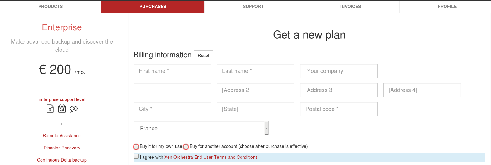

# Through purchase department

If you can't purchase for your own account, because you need to go through a dedicated purchase department in your company, this is the process you need to follow.

In means, there will be:

* a "billing contact" (in general, the purchaser email). This account will have access to invoices. And this is the account which make the purchase and then bind the XO plan for another one.
* a "technical contact", the email of the system administrator using the solution and making support requests.

## As "billing contact"

1. First of all, you need to create an account as a purchaser (eg: "purchase.dept@example.com"). Once it's done, you need to go inside the member zone, in the **purchases** menu.

Now, you just have to pick the edition of Xen Orchestra you want to purchase for your IT team.

2. You will then see the payment screen. If your are not purchasing the edition for yourself, you have to pick the **buy for another account** option. 

3. Once the payment is completed, you will have to bind the plan with the end-user account. If the end-user doesn't have an account yet, the system will create one and send an e-mail to your end user. 

That's it, you have now completed the purchase. 

**Once you have bind the plan to your end user account, you cannot change it. Double check the spelling of the e-mail before binding the account.**
