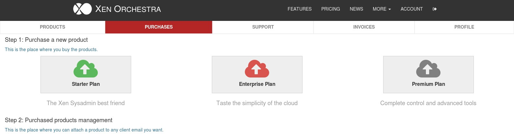
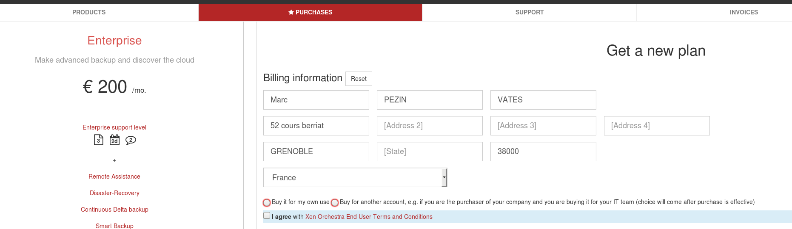

# Through purchase department

If you can't purchase using your own account, usually because you need to go through a dedicated purchase department in your company, this is the process you need to follow.

Typically, you will provide two contacts:

* The "billing contact" (in general, the purchaser email). This account will have access to invoices. This is the account doing the purchase. Once purchased, the license needs to be bind to the second contact account, the technical contact.
* The "technical contact", the email of the system administrator using the solution and making support requests.

## As "billing contact"

1. First of all, you need to create an account as a purchaser (eg: "purchase.dept@example.com"). Once it's done, you need to go inside the member page, in the **purchases** menu.

Now, you just have to pick the edition of Xen Orchestra you want to purchase for your IT team.

2. On the first payment screen, after you choose the plan and the subscription method. You can select the option "Buy for another account"

3. Once the payment is completed, you will have to bind the plan with the end-user account (technical contact). If the end-user doesn't have an account yet, the system will create one and send an e-mail to your end user. 

That's it, you have now completed the purchase. 

**⚠ Once you have bound the plan to your end user account, you cannot change it. Double check the spelling of the e-mail before binding the account.**
