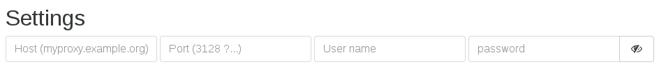
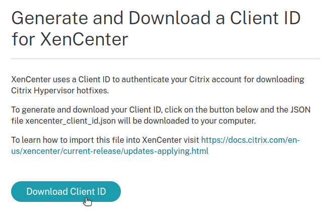
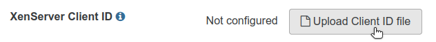

# Updates

All updates are pushed through the updater, which is the central piece that keeps your XO Appliance running the latest Xen Orchestra code.

It also allows you to change your current version into another (Free, Starter, Enterprise or Premium) **without downloading a new XOA**.

:::tip
By design, the updater is only available in XOA. If you are using XO from the sources, you'll have to use `git` commands and rebuild to keep up.
:::

## Requirements

In order to work, the updater needs access to `xen-orchestra.com` (port 443) and `nodejs.org` (port 443).

## Usage

The updater is configurable directly from the web interface, or via the CLI.

### From the web interface

The updater is available in the "Update" menu:


You can see the yellow bell icon: it means your appliance is not registered. You **must register in order to have updates and a trial**.


#### Register

Updates and trials will be available as soon as you register your appliance. To register, use your https://xen-orchestra.com credentials you gave to download it previously (your email and your password):


#### Check for new versions

The updater will check for new versions periodically. A green tick in the menu means your version is up to date:


However, if you want to start a manual check, you can do it by clicking on the "Update" button:


### Release channel

In Xen Orchestra, you can make a choice between two different release channels.

#### Stable 

The stable channel is intended to be a version of Xen Orchestra that is already **one month old** (and therefore will benefit from one month of community feedback and various fixes). This way, users more concerned with the stability of their appliance will have the option to stay on a slightly older (and tested) version of XO (still supported by our pro support).

#### Latest 

The latest channel will include all the latest improvements available in Xen Orchestra. The version available in latest has already been QA'd by our team, but issues may still occur once deployed in vastly varying environments, such as our user base has.

:::tip
To select the release channel of your choice, go to the XOA > Updates view:

:::

### Upgrade

If a new version is found, you'll have an upgrade button and its tooltip displayed:


### Proxy configuration

If you are behind a proxy, you can edit your proxy settings in this panel:



### From the CLI

If your interface is not accessible, or you just prefer to use CLIs commands, it's still possible to perform the same steps. You need to access your XOA via SSH (remember the default credentials: xoa/xoa. Change them ASAP).

#### Register

```console
$ xoa-updater --register
Successfully connected to xoa-updater-service

Please enter your xen-orchestra.com identifiers to register your XOA:
? Email: myemail@example.net
? Password: *****

ℹ Your Xen Orchestra Appliance has been succesfully registered
```

#### Check for new versions

```console
$ xoa-updater
Successfully connected to xoa-updater-service
Checking new versions...ok ✔
New versions available:
  xo-server 4.8.1

ℹ xoa-updater may be run again to upgrade packages
```

#### Upgrade

```console
$ xoa-updater --upgrade
Successfully connected to xoa-updater-service
Checking new versions...ok ✔
New versions available:
  xo-server 4.8.1
[...]
Downloading packages...
Installing new packages...

✔ Your XOA has been successfully updated.
```

## Troubleshooting

If your updater is down, you can restart it with `systemctl restart xoa-updater`.

If you can't fetch updates, perform a few checks from your XOA:

- you should be able to successfully `ping xen-orchestra.com`
- if not, check your `/etc/resolv.conf` file and modify it if necessary (give a correct DNS server)
- use `ifconfig` to check your network configuration
- check your firewall(s) and allow XOA to reach xen-orchestra.com (port 443)

## XenServer Updates

Starting September 2023, XenServer Updates require authentication:

1. Make sure your XenServer hosts have [the proper licenses](https://docs.xenserver.com/en-us/citrix-hypervisor/overview-licensing.html)

2. Go to any XenServer Update URL like [this one](https://support.citrix.com/article/CTX277443/hotfix-xs81e006-for-citrix-hypervisor-81) and log in to check that your account has permissions to download updates. You should see a "Download" button.

3. Go to this URL: [https://support.citrix.com/xencenterclientiddownload](https://support.citrix.com/xencenterclientiddownload) and click "Download Client ID"



4. In Xen Orchestra, go to your User Settings page (bottom left-hand corner) and upload the file `xencenter_client_id.json` you just downloaded from the "XenServer Client ID" section



5. Go to a pool's "Patches" page. You can now install XenServer Updates. If you get a `LICENCE_RESTRICTION` error, it means that [you're missing XenServer licenses on your hosts](https://docs.xenserver.com/en-us/citrix-hypervisor/overview-licensing.html).
