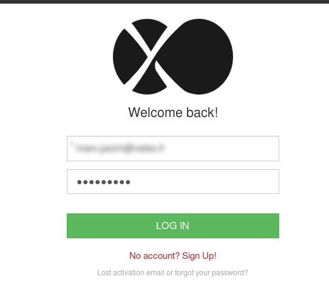
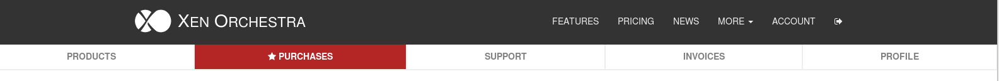
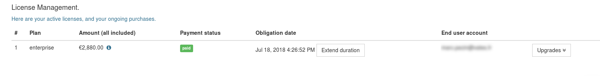
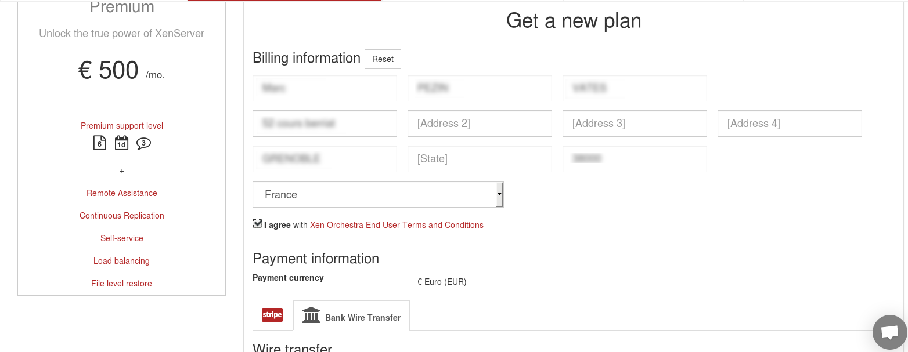
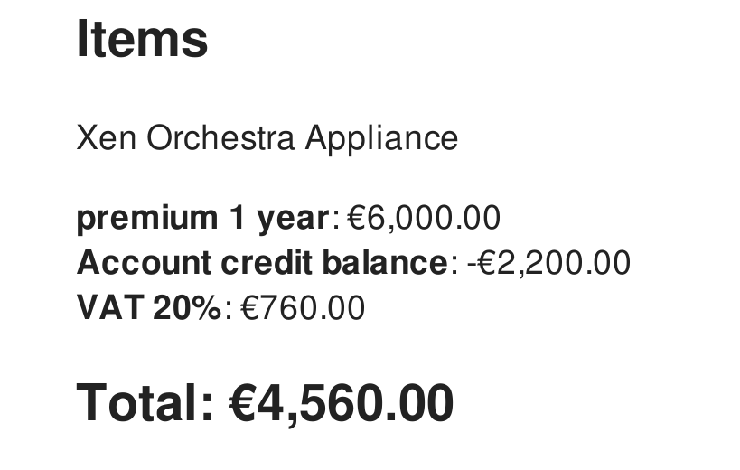
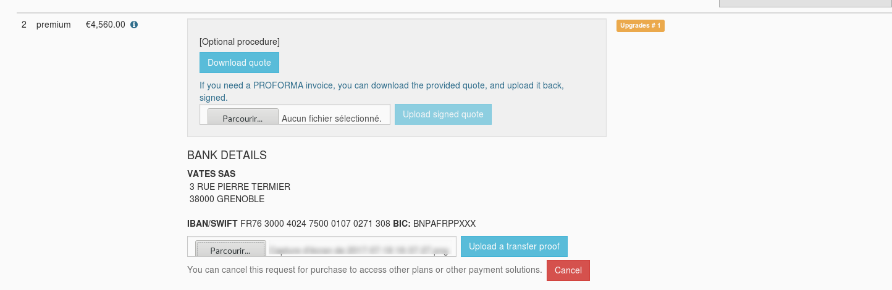

# How to uprade your active plan?

If you want to upgrade your active plan to a higher version of Xen Orchestra, you can do it from your **personal space**. 

### Step by step:

1. Connect on your personal account on the [website](https://xen-orchestra.com/#!/login?source=member.index).  

2. Go on the purchase menu  

3. Pick the line corresponding to the account you want to upgrade. Click on the "upgrade" button on the right.  

4. At this point, you will see a standard subscription page. **Choose the same payment method you used to purchase the initial plan** and confirm the purchase.  

5. If you chosse wire transfer, you have now the possibility to download a quote. As you can see, the remaining period of your previous plan is now a credit note applied on this upgrade.  

6. As for a regular purchase, upload a proof of payment in order for us to activate your new plan as soon as possible.  

7. **Enjoy your new plan!**

  
> As a reseller, the process is quite the same. The only difference is that you have to pick your customer line into you reseller space an not your personal space. 
