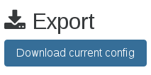

# XOA

XOA is the Xen Orchestra Appliance. XOA is a Debian VM with:

* Xen Orchestra already installed (nothing to do!)
* Tested with all bundled dependencies (QA)
* The web updater (update in one click)
* Support (+SSH support, tooling)
* Secured system (sudo, firewall)

## Specifications

By default, the VM is configured with:

* 2 vCPUs
* 2GB of RAM
* 15GB of disk (10GB for `/` and 5GB for `/var`)

For use on huge infrastructure (more than 500+ VMs), feel free to increase the RAM.

## Deployment

### The quickest way

The **fastest and most secure way** to install Xen Orchestra is to use our web deploy page. Go to https://xen-orchestra.com/#!/xoa and follow the instructions.

> **Note:** no data will be sent to our servers, the deployment only runs between your browser and your host!


### Via a bash script

Alternatively, you can deploy it by connecting to your XenServer host and executing the following:

```
bash -c "$(curl -sS https://xoa.io/deploy)"
```

> **Note:** This won't write or modify anything on your XenServer host: it will just import the XOA VM into your default storage repository.

Follow the instructions:

* Your IP configuration will be requested: it's set to **DHCP by default**, otherwise you can enter a fixed IP address (eg `192.168.0.10`)
* If DHCP is selected, the script will continue automatically. Otherwise a netmask, gateway, and DNS server should be provided.
* XOA will be deployed on your default storage repository. You can move it elsewhere anytime after.

### Via a manual XVA download

You can also download XOA from xen-orchestra.com in an XVA file. Once you've got the XVA file, you can import it with `xe vm-import filename=xoa_unified.xva` or via XenCenter.

After the VM is imported, you just need to start it with `xe vm-start vm="XOA"` or with XenCenter.

## First Login

Once you have started the VM, you can access the web UI by putting the IP you configured during deployment into your web browser. If you did not configure an IP or are unsure, try one of the following methods to find it:  

* Run `xe vm-list params=name-label,networks | grep -A 1 XOA` on your host
* Check your router's DHCP leases for an `xoa` lease

**Note:** The default Web UI credentials are `admin@admin.net` / `admin`


## Registration

**The first thing** you need to do with your XOA is register. [Read the documentation on the page dedicated to the updater/register inferface](updater.md).

## Technical Support

In your appliance, you can access the support section in the XOA menu. In this section you can:

* launch an `xoa check` command


* Open a secure support tunnel so our team can remotely investigate


<a id="ssh-pro-support"></a>

If your web UI is not working, you can also open the secure support tunnel from the CLI. To open a private tunnel (we are the only one with the private key), you can use the command `xoa support tunnel` like below:

```
$ xoa support tunnel
The support tunnel has been created.

Do not stop this command before the intervention is over!
Give this id to the support: 40713
```

Give us this number, and we'll be able to access your XOA in a secure manner. Then, close the tunnel with `Ctrl+C` after your issue has been solved by support.

> The tunnel utilizes the user `xoa-support`. If you want to deactivate this bundled user, you can run `chage -E 0 xoa-support`. To re-activate this account, you must run `chage -E 1 xoa-support`.


### First console connection

If you connect via SSH or console, the default credentials are:

* user: xoa
* password: xoa

During your first connection, the system will ask you to:

* enter the current password again (`xoa`)
* enter your new password
* retype your new password

When it's done, you'll be disconnected, so reconnect again with your new password.

Here is an example when you connect via SSH for the first time:

```
$ ssh xoa@192.168.100.146
Warning: Permanently added '192.168.100.146' (ECDSA) to the list of known hosts.
xoa@192.168.100.146's password:
You are required to change your password immediately (root enforced)
 __   __             ____           _               _
 \ \ / /            / __ \         | |             | |
  \ V / ___ _ __   | |  | |_ __ ___| |__   ___  ___| |_ _ __ __ _
   > < / _ \ '_ \  | |  | | '__/ __| '_ \ / _ \/ __| __| '__/ _` |
  / . \  __/ | | | | |__| | | | (__| | | |  __/\__ \ |_| | | (_| |
 /_/ \_\___|_| |_|  \____/|_|  \___|_| |_|\___||___/\__|_|  \__,_|

Welcome to XOA Unified Edition, with Pro Support.

* Restart XO: sudo systemctl restart xo-server.service
* Display logs: sudo systemctl status xo-server.service
* Register your XOA: sudo xoa-updater --register
* Update your XOA: sudo xoa-updater --upgrade

OFFICIAL XOA DOCUMENTATION HERE: https://xen-orchestra.com/docs/xoa.html

Support available at https://xen-orchestra.com/#!/member/support

Build number: 16.10.24

Based on Debian GNU/Linux 8 (Stable) 64bits in PVHVM mode

WARNING: Your password has expired.
You must change your password now and login again!
Changing password for xoa.
(current) UNIX password:
Enter new UNIX password:
Retype new UNIX password:
passwd: password updated successfully
Connection to 192.168.100.146 closed.
$
```

### Using sudo

To avoid typing `sudo` for any admin command, you can have a root shell with `sudo -s`:

```
[05:24 27] xoa@xoa:~$ sudo -s

We trust you have received the usual lecture from the local System
Administrator. It usually boils down to these three things:

    #1) Respect the privacy of others.
    #2) Think before you type.
    #3) With great power comes great responsibility.

[sudo] password for xoa:
[05:24 27] xoa:xoa$

```

### Network configuration

XOA uses **DHCP** by default, so if you need to configure the IP address, please run the command `xoa network static`. It will ask you network details:

```
$ xoa network static
? Static IP for this machine 192.168.100.120
? Network mask (eg 255.255.255.0) 255.255.255.0
? Gateway 192.168.100.254
? IP of the DNS server 192.168.100.254
```

Xen Orchestra is now accessible in your browser at ` https://your-vm-ip`.

You can access the VM console through XenCenter or using VNC through a SSH tunnel.

If you want to go back in DHCP, just run `xoa network dhcp`


### Firewall

By default XOA is firewalled, with only ports 22, 80 and 443 opened. You can see the current status of the firewall using the `sudo ufw status verbose` command:

```
Status: active
Logging: on (low)
Default: deny (incoming), allow (outgoing)
New profiles: skip

To                         Action      From
--                         ------      ----
22                         ALLOW IN    Anywhere
80                         ALLOW IN    Anywhere
443                        ALLOW IN    Anywhere
22/tcp                     LIMIT IN    Anywhere
22                         ALLOW IN    Anywhere (v6)
80                         ALLOW IN    Anywhere (v6)
443                        ALLOW IN    Anywhere (v6)
22/tcp                     LIMIT IN    Anywhere (v6)
```

If you want to open or close ports, please check the [documentation of UFW](https://help.ubuntu.com/community/UFW).

## Default XO admin account

Default user is **admin@admin.net** with **admin** as a password.

> **SECURITY NOTICE**: create a new admin account and remove this one.

In any case, if you lose your password, you can reset the database and get the default credentials back.

## Timezone

You can verify that your time is correctly set with the `date` command. To set XOA to your current timezone, use `sudo dpkg-reconfigure tzdata`.

## Restart the service

You can restart Xen Orchestra by accessing XOA via SSH (or console) and running `systemctl restart xo-server.service`.

To check the status of `xo-server`, use `systemctl status xo-server.service`, it should display something like this:

```
xo-server.service - XO Server
   Loaded: loaded (/etc/systemd/system/xo-server.service; enabled)
   Active: active (running) since Thu 2014-08-14 10:59:46 BST; 21min ago
 Main PID: 394 (node)
   CGroup: /system.slice/xo-server.service
           └─394 node /usr/local/bin/xo-server

Aug 14 10:59:46 xoa systemd[1]: Starting XO Server...
Aug 14 10:59:46 xoa systemd[1]: Started XO Server.
Aug 14 10:59:48 xoa xo-server[394]: WebServer listening on http://0.0.0.0:80
```

## Migrate from an older XOA

If you still use the first XOA (which was not the "unified" version), you can easily migrate all your settings (ACLs, users, servers, etc) to the new version painlessly.

To do so, go into "Settings/Config" of your old XOA. Export the configuration: you'll download a `config.json` file.



Now go to your new unified XOA, "Settings/Config" and import the `config.json` file you downloaded previously, by doing a drag and drop:


That's it!
