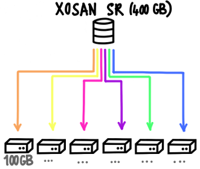

# XOSANv1

XOSAN is a virtual SAN that allows you to create a shared SR (Storage Repository) by combining your existing local SRs. It's a software defined and hyperconverged solution for Citrix Hypervisor.

:::warning
Due to their difference, XOSANv1 (the initial implementation) is incompatible with XCP-ng. For XCP-ng, see the [XOSANv2 dedicated documentation](xosanv2.md).
:::

## Introduction

This documentation will give you some advice and assistance in order to create an XOSAN storage on your XenServer or XCP-ng infrastructure.

## Objectives

XOSAN will "gather" all your local disks (across multiple hosts) into a shared SR, that XenServer/XCP-ng will just see as any other shared SR, without limitations (you can live migrate, snapshot, backup, whatever you need). **It's a fully software defined solution** that doesn't require you to buy extra hardware. It can even run on the disk where your Citrix Hypervisor (Xenserver) or XCP-ng is already installed!

The objectives are to:

- protect your data thanks to replication of data across multiple hosts
- Unlock High Availability without buying a NAS nor a SAN
- give you flexibility to grow your storage by adding new nodes
- work on all kinds of hardware, HDDs or SSDs, with hardware RAID or not

To deploy XOSAN, please follow the rest of the documentation:

- [XOSAN Requirements](xosan_requirements.md)
- [Types of XOSAN](xosan_types.md)
- [How to create a new XOSAN Storage](xosan_create.md)
- [XOSAN management](xosan_management.md)
- [Get a free XOSAN trial](xosan_trial.md)

## Requirements

In order to work, XOSAN need a minimal set of requirements.

### Storage

XOSAN can be deployed on an existing **Local LVM storage**, that XenServer configure by default during its installation. You need 10GiB for XOSAN VM (one on each host) and the rest for XOSAN data, eg all the space left.

However, if you have unused disks on your host, you can also create yourself a local LVM storage while using Xen Orchestra:

- Go on the "New" menu entry, then select "Storage"
- Select the host having the disk you want to use for XOSAN
- Select "Local LVM" and enter the path of this disk (e.g: `/dev/sdf`)

> You can discover disks names by issuing `fdisk -l` command on your XenServer host.

> **Recommended hardware:** we don't have specific hardware recommendation regarding hard disks. It could be directly a disk or even a disk exposed via a hardware RAID. Note that RAID mode will influence global speed of XOSAN.

### Network

XOSAN will use the network card you choose at creation. For better performances, a dedicated storage network should be used.

> **Recommended hardware:** 1 Gbit/s network card is the minmum to have decent performances. However, a **10 Gbits/s** network is preferable, especially for a setup using SSDs or more than 2 nodes.

### RAM

Each XOSAN VM will use 2GiB of RAM. It could be increased (sweet spot seems to be around 4GiB), but it's also workload and infrastructure related. If you don't have a lot of RAM, keep it to 2GiB. If RAM is not an issue, 4GiB is better.

### CPU

Each XOSAN VM deployed will use 2x vCPUs. This setting should be enough for all cases.

### Examples

For a 6 nodes setup, XOSAN will use in total:

- 12 vCPUs (usage is in general pretty low)
- 12 GiB RAM
- All Local LVM disk space

## XOSAN types

There is 2 modes for creating an XOSAN storage. They are different and the choice is done forever. You can't **switch from a mode to another** when XOSAN is created, except by removing and re-creating it.

That's why it's **very important to understand pros and cons** of each type.

:::tip
On "top" of there 2 types, you can also decide to spread all operations to multiple number of volumes. This is called **distributed** mode. It's very similar to _RAID 0_, which can be placed on top of a _RAID 1_ for example. We'll talk about it in the end of this guide.
:::

Here is those 2 types:

- [Replicated](xosan_replicated.md)
- [Disperse](xosan_disperse.md)

### Which mode to choose

In the vast majority of cases, **replicated is better**, because:

- it's almost ALWAYS faster
- it's easier to manage
- it's easier to grow

The only downside is that replicated will "waste" more space.

Using disperse makes sense only if:

- you have big HDDs and you want use the space at most
- you don't use database (or don't care about performances)
- you store big files and you don't need ultra fast data access

XOSAN will need a pool with:

- XenServer 7 or higher
- Local LVM SR with at lease 15GiB of free space on **each** host
- 2 GiB of free RAM on each host for the XOSAN VM
- A working connection with the updater (same way as the XO trial)
- Our XOSAN pack installed on each hosts (it's automatically deployed during the first XOSAN install)

> The pack will install user-space packages and add a new SR type: "xosan". Their will be no other modification. The tool stack has to be restarted to be able to deal with XOSAN (no VM or service interruption). It's also fully automated in the XOSAN install process.

### Optional

- An extra/dedicated physical network for storage to deliver high performances
- 10G networks will deliver higher throughput

## Creation

After the completion of all the requirements, you can install XOSAN itself.

1. Go in your XOSAN panel in Xen Orchestra.

2. Click on `new` and select the pool on which you want to create a shared cluster. Click on `install it now` to install the XOSAN package on every hosts in the pool.

3. Select the PIF on which you want to create the XOSAN network.

4. Select all the SR you want to use in your shared cluster.

> Note: you can only select on SR on each host. If you select SR with different size, the size of the cluster will be limited by the size of the smallest SR selected. We recommend you to use the same type of SR (SSD/HDD) and with the same size to avoid space loss

5. Select the mode you want to use for your cluster: disperse or replicate.

> We do not recommend the disperse mode for now. See [XOSAN types](https://xen-orchestra.com/docs/xosan_types.html) for additional information about modes.

### Advanced options

With the advanced option, you can:

- use a VLAN

  > If you want to use a VLAN, don't forget to configure your switch as well!

- use a custom IP network

- change the total size you want for your shared storage

- increase the memory allocated to XOSAN
  > 2GiB is the minimum to allocate to XOSAN. You will get better result with 4GiB and if you have a lot of memory available, 8GiB is the best.

Once you are ready, you can click on `Create`. XOSAN will automatically deploy itself and create the virtual shared storage you have selected.

> The process can take a few minutes to complete.

## Try it!

XOSAN is a 100% software defined solution for XenServer hyperconvergence. You can unlock a free 50GiB cluster to test the solution in your infrastructure and discover all the benefits you can get by using XOSAN.

### Step 1

You will need to be registered on our website in order to use Xen Orchestra. If you are not yet registered, [here is the way](https://xen-orchestra.com/#!/signup)

SSH in your XenServer and use the command line `curl -sS https://xoa.io/deploy | bash` - it will deploy Xen Orchestra Appliance on your XenServer infrastructure which is required to use XOSAN.

> Note: You can also download the XVA file and follow [these instructions](https://xen-orchestra.com/docs/xoa.html#the-alternative).

### Step 2

Register your XOA appliance

> _If you are not familiar with Xen Orchestra, note that you can also activate a 15 days Premium trial for XOA. More informations [here](https://xen-orchestra.com/#!/trial)_

### Step 3

Access the XOSAN menu and click on the "new" button. By default, your XOSAN will be a trial license, limited to 50GiB of space.

> _You will always have the opportunity to upgrade an existing XOSAN cluster which is in trial version to a standard XOSAN license._
