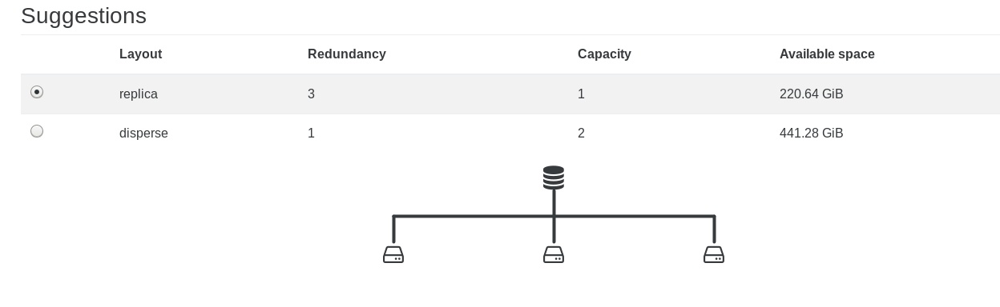

# XOSAN creation guide

## Prerequisites

XOSAN will need a pool with:

* XenServer 7 or higher
* Local LVM SR with at lease 15GiB of free space on **each** host
* 2 GiB of free RAM on each host for the XOSAN VM
* A working connection with the updater (same way as the XO trial)
* Our XOSAN pack installed on each hosts (it's automatically deployed during the first XOSAN install)

> The pack will install user-space packages and add a new SR type: "xosan". Their will be no other modification. The tool stack has to be restarted to be able to deal with XOSAN (no VM or service interruption). It's also fully automated in the XOSAN install process.

### Optional

* An extra/dedicated physical network for storage to deliver high performances
* 10G networks will deliver higher throughput

## Creation

After the completion of all the requirements, you can install XOSAN itself.

1. Go in your XOSAN panel in Xen Orchestra. 

2. Click on `new` and select the pool on which you want to create a shared cluster. Click on `install it now` to install  the XOSAN package on every hosts in the pool. 

3. Select the PIF on which you want to create the XOSAN network. 

4. Select all the SR you want to use in your shared cluster.

> Note: you can only select on SR on each host. If you select SR with different size, the size of the cluster will be limited by the size of the smallest SR selected. We recommend you to use the same type of SR (SSD/HDD) and with the same size to avoid space loss

5. Select the mode you want to use for your cluster: disperse or replicate.

> We do not recommend the disperse mode for now. See [XOSAN types](https://xen-orchestra.com/docs/xosan_types.html) for additional information about modes.

### Advanced options

With the advanced option, you can: 

* use a VLAN
> If you want to use a VLAN, don't forget to configure your switch as well!

* use a custom IP network

* change the total size you want for your shared storage

* increase the memory allocated to XOSAN
> 2GiB is the minimum to allocate to XOSAN. You will get better result with 4GiB and if you have a lot of memory available, 8GiB is the best.

Once you are ready, you can click on `Create`. XOSAN will automatically deploy itself and create the virtual shared storage you have selected.

> The process can take a few minutes to complete. 

