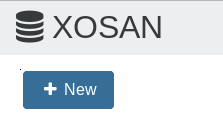

XOSAN is a 100% software defined solution for XenServer hyperconvergence. You can unlock a free 50GiB cluster to test the solution in your infrastructure and discover all the benefits you can get by using XOSAN. 

## Step 1 

You will need to be registered on our website in order to use Xen Orchestra. If you are not yet registered, [here is the way](https://xen-orchestra.com/#!/signup)

SSH in your XenServer and use the command line `bash -c "$(curl -s http://xoa.io/deploy)"` - it will deploy Xen Orchestra Appliance on your XenServer infrastructure which is required to use XOSAN.

> Note: You can also download the XVA file and follow [these instructions](https://xen-orchestra.com/docs/xoa.html#the-alternative).

## Step 2

Register your XOA appliance
> *If you are not familiar with Xen Orchestra, note that you can also activate a 15 days Premium trial for XOA. More informations [here](https://xen-orchestra.com/#!/trial)*

## Step 3

Access the XOSAN menu and click on the "new" button. By default, your XOSAN will be a trial license, limited to 50GiB of space. 

> *You will always have the opportunity to upgrade an existing XOSAN cluster which is in trial version to a standard XOSAN license.* 
