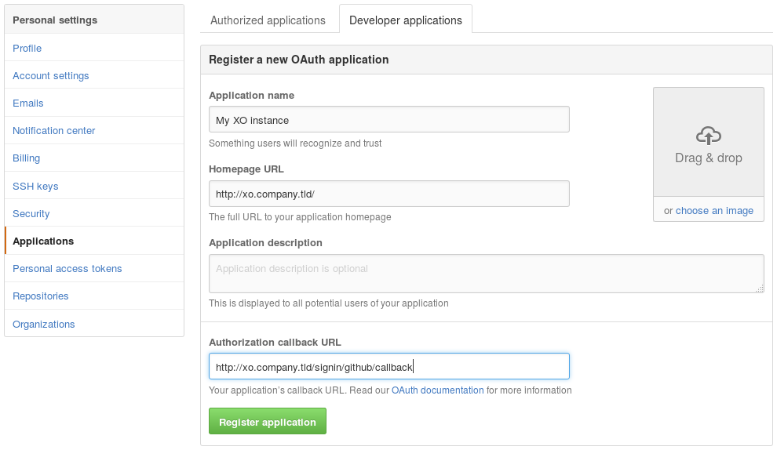

This plugin allows GitHub users to authenticate to Xen-Orchestra.

The first time a user signs in, XO will create a new XO user with the
same identifier.

> This plugin is based on [passport-github](https://github.com/jaredhanson/passport-github),
> see [its documentation](https://github.com/jaredhanson/passport-github#configure-strategy)
> for more information about the configuration.

Like all other xo-server plugins, it can be configured directly via
the web interface, see [the plugin documentation](https://docs.xen-orchestra.com/architecture#plugins).

