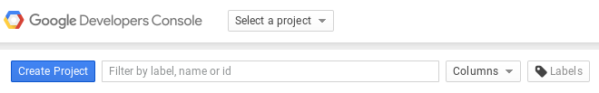
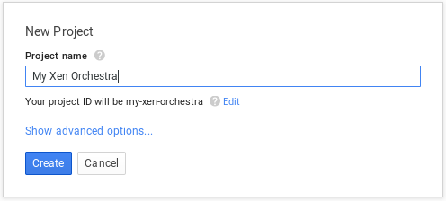
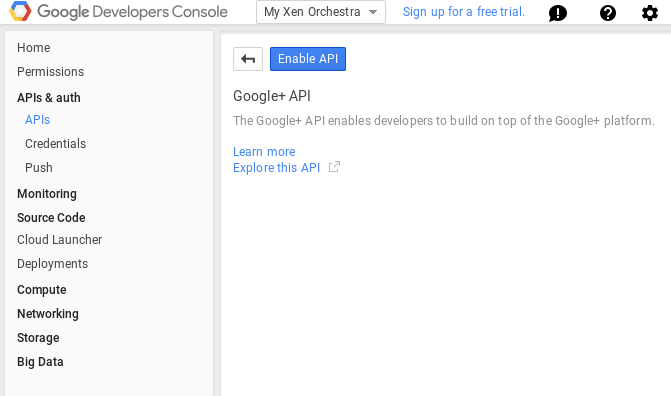
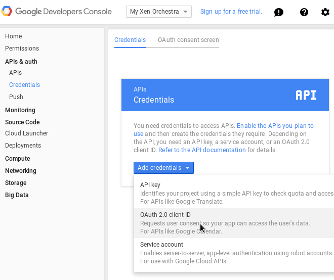
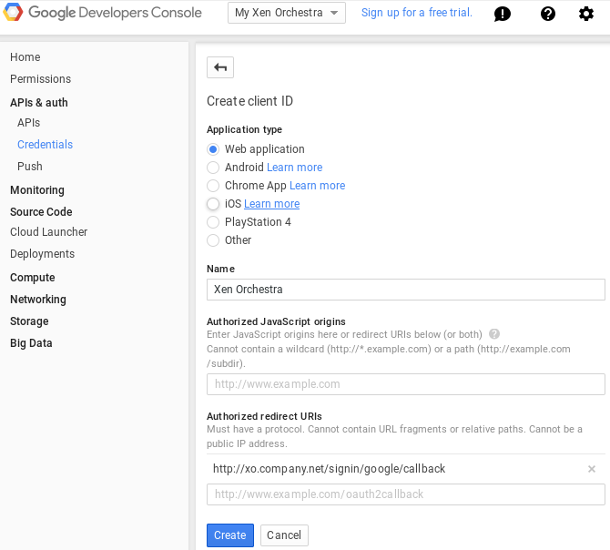

This plugin allows Google users to authenticate to Xen-Orchestra.

The first time a user signs in, XO will create a new XO user with the
same identifier.

> This plugin is based on [passport-google](https://google.com/jaredhanson/passport-google),
> see [its documentation](https://google.com/jaredhanson/passport-google#configure-strategy)
> for more information about the configuration.

### Creating the Google project

[Create a new project](https://console.developers.google.com/project):

Enable the Google+ API:

Add OAuth 2.0 credentials:

### Add the plugin to XO-Server config

Like all other xo-server plugins, it can be configured directly via
the web iterface, see [the plugin documentation](https://docs.xen-orchestra.com/plugins).
