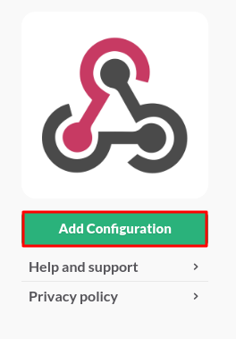
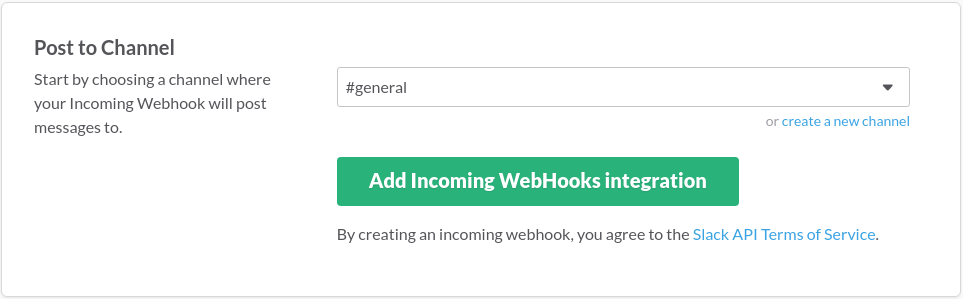
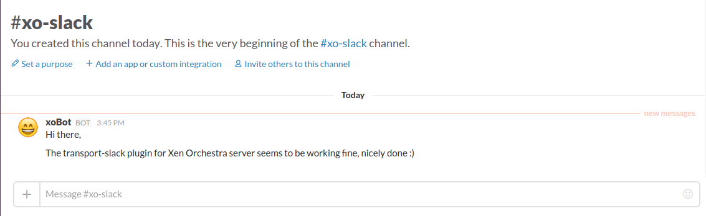
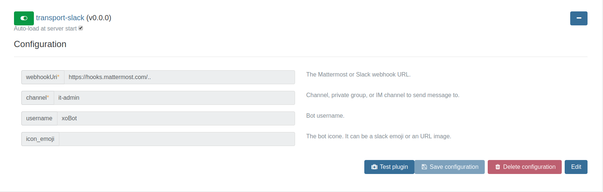
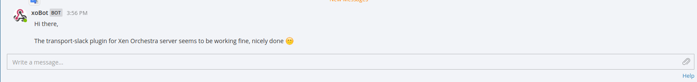

# xo-server-transport-slack [](https://travis-ci.org/vatesfr/xo-server-transport-slack)

> ${pkg.description}

## Install

Installation of the [npm package](https://npmjs.org/package/xo-server-transport-slack):

```
> npm install --global xo-server-transport-slack
```

## Usage

Like all other xo-server plugins, it can be configured directly via
the web iterface, see [the plugin documentation](https://xen-orchestra.com/docs/plugins.html). You can also test the configuration plugin if it works.

### Slack

#### Generate the Webhook

1. Log in your Slack team account
2. Click on the **Main menu** at the top and choose **Apps & Integrations**

   
3. Search **Incoming WebHooks**

   
4. Click on **Add Configuration**

   
5. Choose the default channel and click on **Add Incoming WebHooks integration**

   
6. Modify the default settings and click on **Save Settings**

   

### Testing the plugin

#### Slack




#### Mattermost





## Development

### `Xo#sendSlackMessage({ message }) `

This xo method is called to send the message passed in parameter to Slack or Mattermost.

# Install dependencies
> npm install

# Run the tests
> npm test

# Continuously compile
> npm run dev

# Continuously run the tests
> npm run dev-test

# Build for production (automatically called by npm install)
> npm run build
```

## Contributions

Contributions are *very* welcomed, either on the documentation or on
the code.

You may:

- report any [issue](https://github.com/vatesfr/xo-server-transport-slack/issues)
  you've encountered;
- fork and create a pull request.

## License

AGPL3 © [Vates SAS](https://vates.fr)
