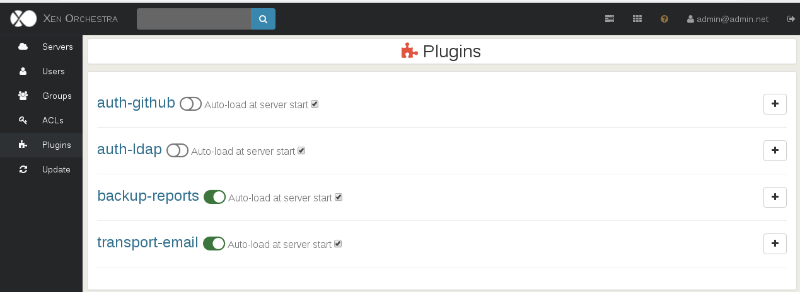

# Plugins

> Since 4.11, installed plugins are automatically displayed

Xen Orchestra plugins allow to extend features without rewriting the core of the application.

You can see your installed plugins in "Settings" then "Plugins" page:

Every plugin configuration should be done in the web interface.