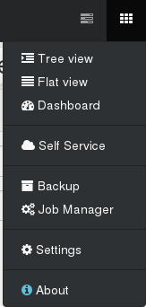

# Self Service

The self-service feature is the possibility for users to create new VMs. That's different from delegating existing resources to them, and it leads to a lot of side-effects.

> This feature is not yet available yet. However, it should be released very soon.

## Set of resources

To create a new set of resources, go inside the "Self Service" section in the main menu:

### Perimeter

To allow people creating VMs as they want, we need to give them a *part* of your XenServer resources (disk space, CPUs, RAM). You can call this "general quotas" if you like. But you need first to decide which resources will be used.

In this example below, we'll create a set called **"sandbox"** with:

* "devs" group could access this set (all users in the group)
* "Lab Pool" is the pool where they can play
* "Debian 8 Cloud Ready" is the only template they could use
* "SSD NFS" is the only SR where they can create VMs
* * Pool-wide network with eth0" is the only available network for them

### Quotas

Only after this, you can limit resources for this set:

* maximum vCPUs, RAM and disk usage
* maximum number of VMs and VDIs

After, you just have to assign a group or a user to this set. Any created VM in this set will give "admin" permission for user/group.

Details are given in [this GitHub issue](https://github.com/vatesfr/xo-web/issues/285). Feel free to contribute to help up!

## Toward the Cloud

Self-service is a major step in the Cloud. Combine it with our [Cloudinit compatible VM creation](cloudinit.md) for a full experience:

* create a Cloud ready template
* create a set and put Cloud templates inside
* delegate this set to a group of users

Now, your authorized users can create VMs with their SSH keys, grow template disks if needed. Everything inside a "sandbox" (the set) you defined earlier!

