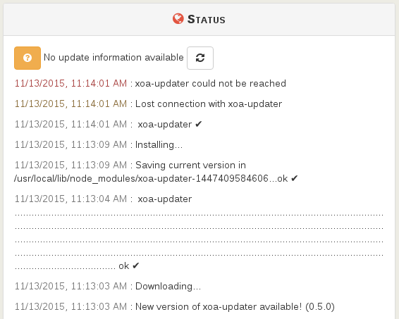

# Updater

The updater is the central piece to get your XOA on the latest bits of Xen Orchestra.

It allows also to transform your current version in any others (Trial, Starter, Enterprise or Premium) **without downloading a new XOA**.

> By design, the updater is only available in XOA. If you are using the XO from the sources, you'll have to use `git` commands and rebuild to keep up.

## Requierements

In order to work, the updater needs to access to xen-orchestra.com (port 443).

## Usage

The updater is configurable directly in the web interface, or via the CLI.

### From the web interface

By default for a new XOA, you'll have this icon in the top right:


It means your appliance is not registered. Click on this icon and follow the next step.

#### Register

Updates and trial will be available as soon as you registered your appliance. To register, use your https://xen-orchestra.com credentials you gave to download it previously (your email and your password):


#### Check for new versions

The updater will check for new versions periodically. Nevertheless, if you want to start a manual check, you can do it by clicking on the "Check for updates" icon.

#### Upgrade

If a new version is found, you'll have an upgrade button displayed:


**In case where the updater is updated itself, you should have to refresh manually the status panel!**

This could be done by clicking on the refresh white icon:



#### Proxy configuration

If you are behind a proxy, you can edit your proxy settings in this panel:


### From the CLI

If you interface is not accessible, or you just prefer to use CLIs commands, it's totally possible to do all the operations. You need to access your XOA by SSH (remember the default credentials: root/xoa. Change them ASAP).

#### Register

```
# xoa-updater --register
Successfully connected to xoa-updater-service

Please enter your xen-orchestra.com identifiers to register your XOA:
? Email: myemail@example.net
? Password: *****

ℹ Your Xen Orchestra Appliance has been succesfully registered
```

#### Check for new versions

```
# xoa-updater
Successfully connected to xoa-updater-service
Checking new versions...ok ✔
New versions available:
  xo-server 4.8.1

ℹ xoa-updater may be run again to upgrade packages

```

#### Upgrade

```
# xoa-updater --upgrade
Successfully connected to xoa-updater-service
Checking new versions...ok ✔
New versions available:
  xo-server 4.8.1
[...]
Downloading packages...
Installing new packages...

✔ Your XOA has been successfully updated.

```

## Troubleshooting

Connect to your XOA in SSH then:

* you should be able to successfully `ping xen-orchestra.com`
* if not, check your `/etc/resolv.conf` file and modify it if necessary (give a correct DNS server)
* use `ifconfig` to check your network configuration
* check your firewall(s) and allow XOA to reach xen-orchestra.com (port 443)